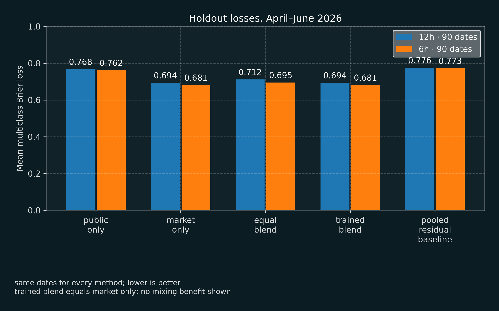
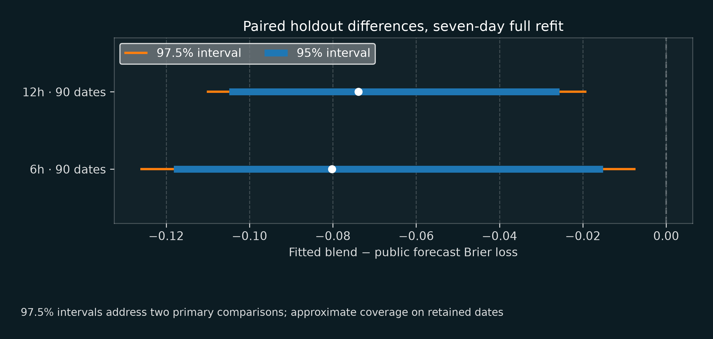
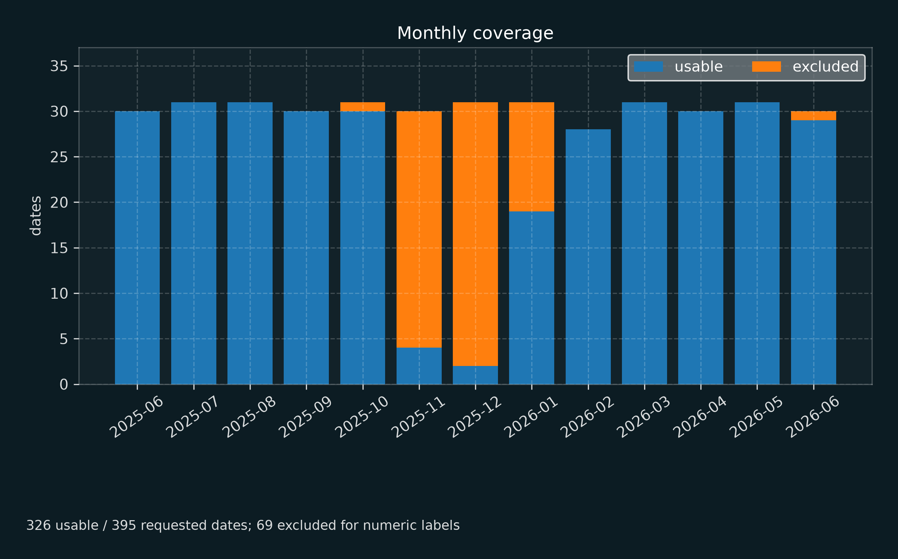

# Kalshi temperature markets vs. NOAA forecasts

This project asks whether prediction-market prices add information beyond a public weather
forecast, and whether that contribution can be identified before the outcome. It compares
archived Kalshi New York daily-high markets with NOAA NDFD forecasts at 12 and 6 hours before
the Central Park settlement day begins.

## Main finding

On 90 held-out dates (April to June 2026), the market had lower mean multiclass Brier loss than the calibrated NOAA forecast at both checkpoints: 0.6939 vs. 0.7678 at 12 hours and 0.6815 vs. 0.7617 at 6 hours. The 95% block-bootstrap intervals for the difference exclude zero at both horizons (see [Uncertainty](#uncertainty)). A blend whose weight was fit on earlier dates put all of its weight on the market, so adding the public forecast did not help. Disagreement between the two sources did not reliably show in advance when the market's advantage would be larger.

The study covers 2025-06-01 through 2026-06-30. Of 395 requested dates, 326 have usable numeric settlement labels (652 scored cases across the two checkpoints); the other 69 are excluded (see [Data coverage](#data-coverage)).

## Holdout scores

Mean multiclass Brier loss on the same held-out cases; lower is better.

| checkpoint | public only | market only | equal blend | trained blend | pooled residual baseline | dates | cases |
| --- | --- | --- | --- | --- | --- | --- | --- |
| 12h | 0.7678 | 0.6939 | 0.7116 | 0.6939 | 0.7759 | 90 | 90 |
| 6h | 0.7617 | 0.6815 | 0.6950 | 0.6815 | 0.7728 | 90 | 90 |



Model selection chose the seasonal ridge residual model, λ = 1. Out-of-fold error folds run from 2025-07-01 through 2026-03-01. The blend weight was fit on 348 eligible checkpoint predictions across 174 dates, 2025-08-01 through 2026-03-30.

## Data and methods

The outcome is the Central Park settlement-day high, divided into market bins. Market probabilities use normalized hourly bid/ask candle closes, which are historical proxies rather than executable prices. The public predictor is the NOAA NDFD MaxT grid forecast, calibrated to settlement bins using earlier labels.

The multiclass Brier score for one case sums squared errors across settlement bins,
with no division by the bin count:

$$BS_i = \sum_{k=1}^{K} \left(p_{i,k} - \mathbb{1}[k = k_i^{*}]\right)^2$$

Here $p_{i,k}$ is the forecast probability assigned to bin $k$ for case $i$, $k_i^{*}$ is the
realized settlement bin, and $K$ is the number of bins in that contract. Reported scores average
$BS_i$ over the $N$ cases in a split:

$$\overline{BS} = \frac{1}{N}\sum_{i=1}^{N} BS_i$$

Log loss floors the winning-bin probability at $\epsilon = 10^{-6}$ and does not renormalize the
probability vector:

$$LL_i = -\log\left(\max(p_{i,k_i^{*}},\ \epsilon)\right), \qquad \overline{LL} = \frac{1}{N}\sum_{i=1}^{N} LL_i$$

The fitted blend is a fixed convex combination of the market and public probability vectors,
with the weight fit out-of-fold on pre-holdout dates and then held fixed for scoring:

$$p_{\text{blend}} = w \, p_{\text{market}} + (1 - w) \, p_{\text{public}}, \qquad w \in [0, 1]$$

Development uses June–December 2025, model selection uses January–March 2026, and the holdout
uses April–June 2026. Every method is scored on the same eligible cases.

## Uncertainty

Fitted blend minus public forecast Brier loss; negative values favor the blend. The nominal 97.5% intervals use a Bonferroni adjustment for the two horizon comparisons. The point estimates are the market's Brier loss minus the public forecast's, since the blend put all its weight on the market; the full-refit intervals also refit the blend weight in each bootstrap draw. All intervals use 5,000 bootstrap draws.

| checkpoint | fit treatment | difference | 95% interval | 97.5% interval |
| --- | --- | --- | --- | --- |
| 12h | full refit, 7-day blocks | -0.0739 | [-0.1049, -0.0256] | [-0.1103, -0.0191] |
| 6h | full refit, 7-day blocks | -0.0802 | [-0.1182, -0.0152] | [-0.1262, -0.0074] |
| 12h | full refit, 3-day blocks | -0.0739 | [-0.1150, -0.0222] | [-0.1214, -0.0161] |
| 6h | full refit, 3-day blocks | -0.0802 | [-0.1312, -0.0166] | [-0.1398, -0.0092] |
| 12h | full refit, 14-day blocks | -0.0739 | [-0.0961, -0.0371] | [-0.0996, -0.0330] |
| 6h | full refit, 14-day blocks | -0.0802 | [-0.1059, -0.0287] | [-0.1120, -0.0236] |
| 12h | fixed fit, 7-day blocks | -0.0739 | [-0.1030, -0.0326] | [-0.1078, -0.0274] |
| 6h | fixed fit, 7-day blocks | -0.0802 | [-0.1165, -0.0270] | [-0.1230, -0.0217] |



Each full-refit draw repeats model selection, calibration, blend fitting, and condition assignment. Fixed-fit draws hold the fitted pipeline constant. Blocks stay within calendar months; this underweights dates near month edges, especially with 14-day blocks.

## Sensitivities

These point sensitivities have no separate bootstrap intervals.

| sensitivity | checkpoint | difference from primary |
| --- | --- | --- |
| development-label substitution | 12h | 0.0000 |
| development-label substitution | 6h | 0.0000 |
| simplex normalization | 12h | -0.0020 |
| simplex normalization | 6h | 0.0003 |

## Disagreement subgroups

**12h disagreement subgroup.** high disagreement: 68 dates in 13 calendar blocks. low disagreement: 22 dates in 9 calendar blocks. The saved support thresholds were met. The direct high-minus-low interaction is -0.0551, 95% interval [-0.1582, -0.0047] (excludes zero), 97.5% interval [-0.1677, 0.0052] (includes zero).

**6h disagreement subgroup.** high disagreement: 73 dates in 13 calendar blocks. low disagreement: 17 dates in 8 calendar blocks. Interval unavailable: the low-disagreement group has 17 dates, below the 20-date minimum.

These subgroup interactions are exploratory and do not establish a reliable pre-outcome selection rule.

## Data coverage

Missing numeric settlement labels are concentrated in autumn and winter. June 23, 2026 is also absent from the holdout for this reason. This selection may bias seasonal and holdout comparisons.

Excluded dates are those whose archived Kalshi market records have an empty settlement value (`expiration_value`). All 69 exclusions have this cause, and 67 of them fall in November 2025 to January 2026.

| month | requested | usable | excluded |
| --- | --- | --- | --- |
| 2025-06 | 30 | 30 | 0 |
| 2025-07 | 31 | 31 | 0 |
| 2025-08 | 31 | 31 | 0 |
| 2025-09 | 30 | 30 | 0 |
| 2025-10 | 31 | 30 | 1 |
| 2025-11 | 30 | 4 | 26 |
| 2025-12 | 31 | 2 | 29 |
| 2026-01 | 31 | 19 | 12 |
| 2026-02 | 28 | 28 | 0 |
| 2026-03 | 31 | 31 | 0 |
| 2026-04 | 30 | 30 | 0 |
| 2026-05 | 31 | 31 | 0 |
| 2026-06 | 30 | 29 | 1 |



## Limitations

NDFD MaxT covers 12:00–00:00 UTC, while the Central Park settlement day runs from 05:00 UTC to 05:00 UTC. Calibration does not recover the missing overnight information.

The bootstrap repeats model selection and fitting but cannot recover missing labels or unknown archive revisions. Month-stratified, nonwrapping blocks also underweight dates near month boundaries.

Hourly bid/ask candle closes do not establish fills, depth, fees, or profitability.

## Notebooks and sources

The [replication notebook](notebooks/06_historical_replication.ipynb) contains the expanded
study. The [historical study notebook](notebooks/05_historical_study.ipynb) shows the earlier
empirical analysis, and the [NDFD extraction notebook](notebooks/04_noaa_grid_validation.ipynb)
checks a retained forecast bulletin. All three include saved outputs.

The [research protocol](docs/RESEARCH_PROTOCOL.md) gives the complete model, split, and
uncertainty definitions. [Sources and data boundaries](docs/SOURCES.md) records the source
references and reconstruction limits. The [standalone report](reports/report.md) presents the
same results.

## Reproduce the report

Install the locked environment, run the checks and tests, and verify the checked-in report
against its evidence manifest:

```sh
uv sync --locked --dev
make check
uv run --locked python scripts/verify_portfolio.py
```

The checked-in report and evidence manifest are portable. Recomputing the empirical results and
rebuilding the report require the retained source caches under `outputs/historical-study/` and
`outputs/historical-replication/`:

```sh
uv run --isolated --locked --offline python scripts/reproduce_historical.py
uv run --locked python scripts/run_replication.py --stage all --offline --workers 8
uv run --locked python scripts/verify_replication_sources.py
uv run --locked python scripts/build_portfolio.py
```

Replay verifies saved bytes and source identities. It does not silently replace a retained
response with a newer archive response. [Sources and data boundaries](docs/SOURCES.md) lists the
data references, reconstruction limits, and redistribution caveats.

The [evidence manifest](reports/portfolio-evidence.json) hashes the source result, scientific
inputs, standalone report, HTML page, and exact aggregate data behind each figure. Source code
and replay scripts are tracked here; raw inputs and fitted runs stay outside Git.
